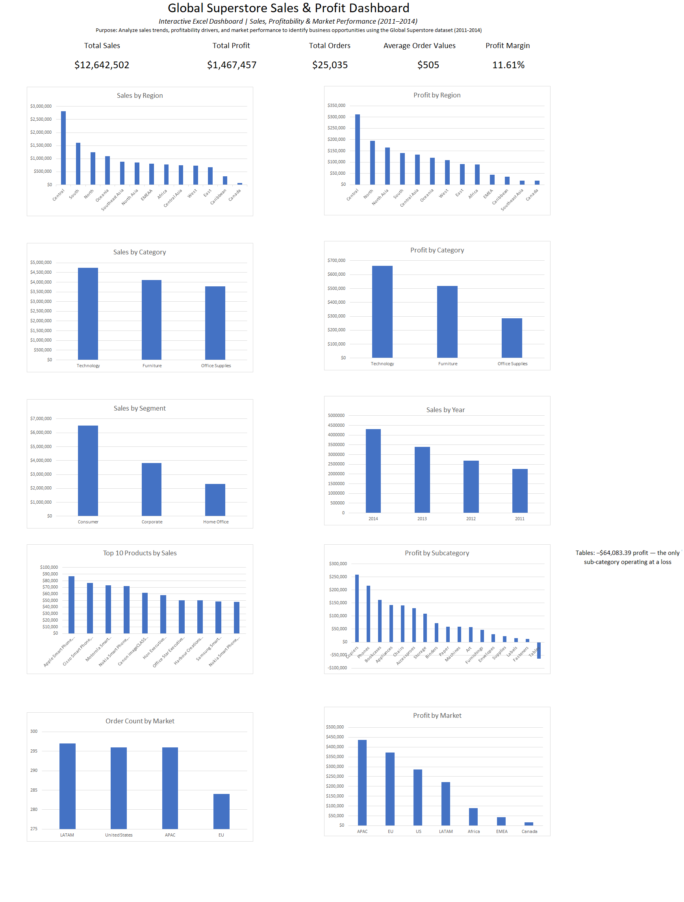

# Global Superstore Sales & Profit Analysis

## Project Overview

This project analyzes sales and profitability data from the Global Superstore dataset using Microsoft Excel. The analysis focuses on identifying key business trends, evaluating profitability across markets, regions, categories, and subcategories, and developing actionable recommendations based on sales performance.

## Business Objective

The objective of this project is to analyze sales and profit performance across different markets, regions, categories, and subcategories while identifying opportunities to improve profitability and overall business performance.

## Key Performance Indicators

- Total Sales: $12,642,502
- Total Profit: $1,467,457
- Total Orders: 25,035
- Average Order Value: $505
- Profit Margin: 11.61%

## Key Business Insights

### 1. Sales Performance

**Technology** leads all product categories with **$4.74M in sales**, followed by **Furniture ($4.11M)** and **Office Supplies ($3.79M)**. Technology's leading sales perfomance highlights its importance as the company's strongest revenue-generating category. 

### 2. Profibility Analysis

Technology alsos leads in overall profit with **663,778.73**. However, **Furniture** generated the weakest profitability relative to its sales volume, producing only **$285,204.72 in profit** compared with **Office Supplies' $518,473.83** on a simiilar level of sales. This suggests an opportunity to investigate Furniture's pricing, discounting, and operating costs. 

### 3. Regional Performance

**Central** was the strongest-performing region, generating **2.82M in sales** and **$311,403.98 in profit**. In contrast, **Canada** was the weakest-performing region, with  **66,928.17 in sales** and **17,817.39 in profit**, indicating an opprtunity to investigate regional perfomance and identify potential growth strategies 

### 4. Product Perfomance

The *Apple smartphone** was the top-selling individual product, generating **$86,935.78 in sales**. However, the **Tables** subcategory generated a **$64,083.39 loss** despite generating sales, representing the largest profitability gap identified in the dataset and a key area for further investigation. 

### 5. Market Trends

Total sales increased by **90.3%**, growing from **$2.26M in 2011** to **4.30M**. Sales increased consistently each year, indicating strong overall growth and positive momentum throughout the analysis period.

## Business Recommendations

- Investigate the factors contributing to losses within the **Tables** subcategory, including pricing, discounting, shipping costs, and individual product performance.

- Evaluate **Furniture's** pricing, discounting, and operating costs to identify opportunities to improve profitability.

- Investigate the performance of the **Canada market** and identify potential opportunities to increase sales and profitability.

- Monitor **returned orders by market** to identify potential product quality, customer satisfaction, or service issues.

- Focus resources on **high-performing product categories and regions** while developing targeted strategies to improve underperforming areas.

- Use ongoing profitability and return-rate monitoring to support **data-driven pricing, product, and market decisions**.

## Tools & Methodology

- Microsoft Excel

- Data Cleaning and Preparation

- Pivot Tables

- KPI Analysis

- Data Visualization

- Profitability Analysis

- Business Insight Development

The dataset was cleaned and prepared before analysis. Pivot tables were created to evaluate sales, profit, orders, profitability, markets, regions, categories, and subcategories. An interactive dashboard was then developed to summarize key findings and provide a visual overview of business performance from **2011 to 2014**.

## Dashboard Features

The interactive dashboard provides an overview of:

- Overall sales and profitability performance

- Sales and profit by market and region

- Category and subcategory performance

- Product-level sales analysis

- Order performance and market trends

- Profit margin and key performance indicators

- Returned orders by market

## Dashboard Preview

## Data Source

Global Superstore dataset used for educational and portfolio analysis purposes.
